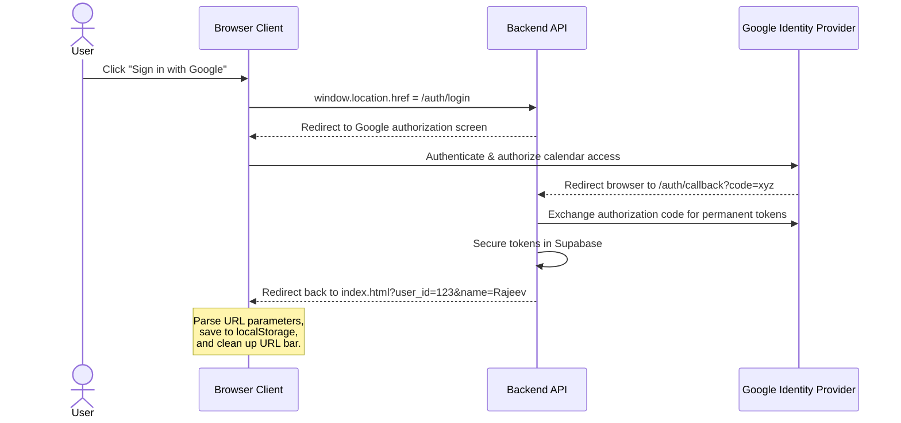

# AVA Calendar Assistant API Reference Guide for Frontend Engineers

Welcome to the **AVA API Frontend Integration Guide**. This document is designed specifically for **frontend engineers** (including absolute freshers) who are building client interfaces, browser dashboards, or integration scripts to communicate with the AVA backend.

This guide acts as both a tutorial and a technical reference. It breaks down every single one of the project's **8 API endpoints**, explaining exactly how to call them from the client browser, handle responses, manage authentication, and handle error scenarios.

---

## Table of Contents
1. [Core Frontend Technical Concepts](#1-core-frontend-technical-concepts)
2. [Interactive Swagger Testing](#2-interactive-swagger-testing)
3. [Full API Endpoint Reference (All 8 Endpoints)](#3-full-api-endpoint-reference-all-8-endpoints)
   * [3.1 Health Check (GET /health)](#31-health-check-get-health)
   * [3.2 System Metrics (GET /api/stats)](#32-system-metrics-get-apistats)
   * [3.3 Process Command via REST (POST /api/command)](#33-process-command-via-rest-post-apicommand)
   * [3.4 Retrieve Calendar Events (GET /api/events)](#34-retrieve-calendar-events-get-apievents)
   * [3.5 Real-Time Wake & Chat Connection (WebSocket /ws/{user_id})](#35-real-time-wake--chat-connection-websocket-wsuser_id)
   * [3.6 Initiate Google Authentication (GET /auth/login)](#36-initiate-google-authentication-get-authlogin)
   * [3.7 OAuth Redirection Callback (GET /auth/callback)](#37-oauth-redirection-callback-get-authcallback)
   * [3.8 User Authentication Sign Out (GET /auth/logout)](#38-user-authentication-sign-out-get-authlogout)
4. [The OAuth & Frontend State Lifecycle](#4-the-oauth--frontend-state-lifecycle)
5. [Standard Frontend Integration Templates](#5-standard-frontend-integration-templates)
6. [HTTP Status Code & Error Handling Table](#6-http-status-code--error-handling-table)

---

## 1. Core Frontend Technical Concepts

Before building interface interactions, let us review how a frontend client communicates with the AVA backend:

### A. Endpoint Paths (Routes)
The backend listens for requests at standard paths (e.g., `/health` or `/api/command`). If you are running the backend server locally, the base URL is:
`http://127.0.0.1:8000`

### B. HTTP Methods
* **`GET`**: Used when the frontend wants to request data from the server. (Examples: Loading upcoming events, checking server statistics).
* **`POST`**: Used when the frontend wants to send data to the server to perform an action. (Example: Sending a text command to schedule an event).

### C. JSON Formatting
All data sent to or received from the API is formatted as JSON (JavaScript Object Notation). On the frontend, you convert JavaScript objects to JSON strings before sending, and parse incoming JSON responses back into JavaScript objects:
```javascript
// Sending: JSON.stringify(javascriptObject)
// Receiving: response.json()
```

### D. REST vs. WebSockets
* **REST (HTTP)**: The browser sends a single request, the server returns a response, and the connection closes immediately. This is standard for simple queries.
* **WebSockets (WS)**: The browser opens a persistent, active connection channel. This allows real-time, bi-directional communication, meaning the server can push audio or chat statuses to the browser without the browser asking first.

---

## 2. Interactive Swagger Testing

AVA is built on **FastAPI**. It automatically exposes an interactive **Swagger UI** for testing:
👉 **[http://127.0.0.1:8000/docs](http://127.0.0.1:8000/docs)**

Use this page during development to verify database states, manually trigger operations, and examine expected request and response payloads.

---

## 3. Full API Endpoint Reference (All 8 Endpoints)

---

### 3.1 Health Check (GET /health)

#### Description
Used by the frontend to verify if the backend server is active and responding. Call this at application startup or as a ping test before opening heavy WebSocket connections.

* **Path**: `/health`
* **Method**: `GET`
* **Frontend Implementation**: Use standard `fetch` API. No headers or payload required.

#### Response Details
* **Status Code**: `200 OK`
* **Response Body Fields**:
  * `status` (String): Returns `"healthy"` when the server is fully operational.
  * `version` (String): Represents the semantic API code version.
  * `daily_api_remaining` (Integer): The remaining number of external LLM calls left for the system.
* **JSON Payload Example**:
  ```json
  {
    "status": "healthy",
    "version": "2.0.0",
    "daily_api_remaining": 1500
  }
  ```

---

### 3.2 System Metrics (GET /api/stats)

#### Description
Retrieves server-wide operational statistics. Use this endpoint to populate dashboard status widgets, active developer monitoring logs, or rate limit dials in the admin view.

* **Path**: `/api/stats`
* **Method**: `GET`
* **Frontend Implementation**: Use standard `fetch` API. No headers or payload required.

#### Response Details
* **Status Code**: `200 OK`
* **Response Body Fields**:
  * `active_sessions` (Integer): The number of active user sessions currently loaded in server memory.
  * `total_sessions_created` (Integer): The running total of user sessions created since the server process started.
  * `daily_api_remaining` (Integer): The number of allowed LLM calls remaining in the daily window.
  * `rate_limiter_can_request` (Boolean): Indicates whether the rate limiter is accepting new requests (`true`) or if the client must wait (`false`).
* **JSON Payload Example**:
  ```json
  {
    "active_sessions": 3,
    "total_sessions_created": 15,
    "daily_api_remaining": 1498,
    "rate_limiter_can_request": true
  }
  ```

---

### 3.3 Process Command via REST (POST /api/command)

#### Description
Submits a natural language text command (typed or spoken) to the backend to parse intents and perform calendar updates. This is the main fallback route if WebSocket connections are unavailable.

* **Path**: `/api/command`
* **Method**: `POST`
* **Frontend Implementation**: Use `fetch` with `method: "POST"`, `Content-Type: "application/json"`, and a stringified JSON body.

#### Request Payload
* **Headers**: `Content-Type: application/json`
* **Body Parameters**:
  | Property | Data Type | Required | Description | Example Value |
  | :--- | :--- | :--- | :--- | :--- |
  | `text` | String | **Yes** | The plain-text command. Must not be blank or whitespace-only. | `"Meet Priya tomorrow at 2 PM"` |
  | `user_id` | String | **Yes** | The unique database ID representing the user. | `"google-oauth2|123456789"` |
  | `user_name` | String | No | The display name of the user (used for personalized voice responses). Defaults to `"User"`. | `"Rajeev"` |
  | `timezone` | String | No | Client's local timezone (e.g. `"Asia/Kolkata"`). Defaults to server timezone. | `"Asia/Kolkata"` |

* **Request Example**:
  ```json
  {
    "text": "Meet Priya tomorrow at 2 PM",
    "user_id": "google-oauth2|123456789",
    "user_name": "Rajeev",
    "timezone": "Asia/Kolkata"
  }
  ```

#### Response Details
* **Status Code**: `200 OK`
* **Response Body Fields**:
  * `intent` (String/Null): The category of action detected (`create_event`, `read_events`, `update_event`, `delete_event`, or `null` if it is a general chat greeting).
  * `entities` (Object): Parsed variables such as `title`, `start_time` (ISO 8601 string), and `end_time` (ISO 8601 string).
  * `action_result` (String): The direct, raw response showing what was written to the Google Calendar API.
  * `response` (String): The formatted natural language response to display on screen and play aloud via the Web Speech Synthesis API.
  * `used_local_classifier` (Boolean): Returns `true` if the server processed the request locally using local SVM models, or `false` if it routed the request to the remote Gemini LLM.
* **JSON Payload Example**:
  ```json
  {
    "intent": "create_event",
    "entities": {
      "title": "Meet Priya",
      "start_time": "2026-06-03T14:00:00+05:30",
      "end_time": "2026-06-03T15:00:00+05:30"
    },
    "action_result": "Successfully created 'Meet Priya' on Wednesday, June 03, 2026 from 02:00 PM to 03:00 PM",
    "response": "Rajeev, I've successfully scheduled 'Meet Priya' for tomorrow at 2:00 PM.",
    "used_local_classifier": false
  }
  ```

---

### 3.4 Retrieve Calendar Events (GET /api/events)

#### Description
Fetches a list of upcoming calendar events scheduled for the next 7 days. Use this endpoint to sync and populate the upcoming events dashboard list.

* **Path**: `/api/events`
* **Method**: `GET`
* **Frontend Implementation**: Must append the `user_id` as a **Query Parameter** to the end of the URL path. No request body allowed.

#### Request Parameters
* **Query Parameters**:
  * `user_id` (String, **Required**): The unique authenticated database ID of the user.
* **Request URL Example**:
  `http://127.0.0.1:8000/api/events?user_id=google-oauth2|123456789`

#### Response Details
* **Status Code**: `200 OK` (Success) or `401 Unauthorized` (User session expired or Google credentials not authorized).
* **Response Body Fields**:
  * `events` (String): A formatted list of events, times, and locations.
* **JSON Payload Example**:
  ```json
  {
    "events": "Found 1 event(s):\n\n1. Meet Priya\n   Time: Wednesday, June 03, 2026 at 02:00 PM - 03:00 PM"
  }
  ```

---

### 3.5 Real-Time Wake & Chat Connection (WebSocket /ws/{user_id})

#### Description
Establishes a persistent, bi-directional WebSocket connection. Use this for the main desktop voice-control interface to stream microphone wake-word signals, commands, and receive low-latency text-to-speech outputs.

* **WebSocket Path**: `/ws/{user_id}` (Replace `{user_id}` with the authenticated user ID).
* **Protocol**: `ws://` (Local development) or `wss://` (Production secure environments).

#### Client-to-Server JSON Frame
The frontend sends commands down the open socket using:
```json
{
  "text": "Show my schedule tomorrow",
  "user_name": "Rajeev",
  "timezone": "Asia/Kolkata"
}
```

#### Server-to-Client JSON Frames
The backend can stream different types of messages:

* **Success Responses (`"type": "response"`)**:
  ```json
  {
    "type": "response",
    "intent": "read_events",
    "entities": {
      "start_time": "2026-06-03T00:00:00+05:30",
      "end_time": "2026-06-03T23:59:59+05:30"
    },
    "action_result": "Found 1 event(s):\n\n1. Meet Priya\n   Time: Wednesday, June 03, 2026 at 02:00 PM - 03:00 PM",
    "response": "Here is your agenda for tomorrow, Rajeev: you have Meet Priya at 2:00 PM.",
    "used_local_classifier": true
  }
  ```

* **System Warnings (`"type": "warning"`)**:
  Sent when the server needs to throttle client rates to protect API keys:
  ```json
  {
    "type": "warning",
    "message": "Rate limit approached. Waiting 1.5s..."
  }
  ```

* **System Errors (`"type": "error"`)**:
  ```json
  {
    "type": "error",
    "message": "Please sign in with Google first."
  }
  ```

---

### 3.6 Initiate Google Authentication (GET /auth/login)

#### Description
Redirects the user to Google’s OAuth 2.0 secure login portal.

* **Path**: `/auth/login`
* **Method**: `GET`
* **Frontend Implementation**: **Do not call this via `fetch`.** This is a redirection endpoint. The frontend must navigate the window directly to this URL.

#### Frontend Code Example
```javascript
function handleLogin() {
    window.location.href = "http://127.0.0.1:8000/auth/login";
}
```

---

### 3.7 OAuth Redirection Callback (GET /auth/callback)

#### Description
This is the redirection endpoint registered with the Google Developer Console. After the user logs in, Google redirects the browser here with an authorization code. 

The backend processes the code, saves the user's encrypted calendar tokens to the database, and redirects the browser back to the frontend homepage (`/`) with user metrics appended as URL parameters.

* **Path**: `/auth/callback`
* **Method**: `GET`
* **Parameters**: Handled automatically by Google and the backend.
* **Frontend Behavior**: The frontend home page must listen for query parameters at startup.

#### Expected Redirection URL in Browser
`http://localhost:3000/?user_id=google-oauth2|123456789&name=Rajeev&picture=https://lh3.googleusercontent.com/...`

---

### 3.8 User Authentication Sign Out (GET /auth/logout)

#### Description
Terminates the user's active backend session and revokes authentication keys.

* **Path**: `/auth/logout`
* **Method**: `GET`
* **Frontend Implementation**: The frontend must clear its `localStorage` keys and redirect the browser to this endpoint.

#### Frontend Code Example
```javascript
function handleLogout() {
    // 1. Clear local memory
    localStorage.removeItem('ava_user_id');
    localStorage.removeItem('ava_user_name');
    localStorage.removeItem('ava_user_picture');
    
    // 2. Redirect to clean up backend states
    window.location.href = "http://127.0.0.1:8000/auth/logout";
}
```

---

## 4. The OAuth & Frontend State Lifecycle

Frontend engineers must manage user credentials securely. Below is the operational lifecycle of how user details are received, stored, and verified:



### Parsing Authentication at Startup
When `index.html` loads, the frontend must inspect the URL bar for incoming parameters from the callback redirection:

```javascript
document.addEventListener('DOMContentLoaded', () => {
    const urlParams = new URLSearchParams(window.location.search);
    
    if (urlParams.has('user_id')) {
        // Save user parameters in local storage
        localStorage.setItem('ava_user_id', urlParams.get('user_id'));
        if (urlParams.has('name')) {
            localStorage.setItem('ava_user_name', urlParams.get('name'));
        }
        if (urlParams.has('picture')) {
            localStorage.setItem('ava_user_picture', urlParams.get('picture'));
        }
        
        // Clean up the browser address bar to hide parameters
        window.history.replaceState({}, document.title, window.location.pathname);
    }
    
    // Verify if user is logged in
    const userId = localStorage.getItem('ava_user_id');
    if (userId) {
        initializeApplication(userId);
    } else {
        showLoginScreen();
    }
});
```

---

## 5. Standard Frontend Integration Templates

---

### 5.1 JavaScript WebSocket Controller
Copy-paste this boilerplate class to manage your persistent WebSockets, handle connection closures, and execute automatic reconnects.

```javascript
class AvaWebSocketController {
    constructor(userId, onMessageCallback, onStatusChangeCallback) {
        this.userId = userId;
        this.onMessage = onMessageCallback;
        this.onStatusChange = onStatusChangeCallback;
        this.socket = null;
        this.reconnectTimeout = 3000; // 3 seconds
        this.isConnecting = false;
    }

    connect() {
        if (this.socket || this.isConnecting) return;
        this.isConnecting = true;
        
        const protocol = window.location.protocol === 'https:' ? 'wss:' : 'ws:';
        const host = window.location.host;
        const uri = `${protocol}//${host}/ws/${this.userId}`;

        this.socket = new WebSocket(uri);

        this.socket.onopen = () => {
            this.isConnecting = false;
            this.onStatusChange(true, "Connected");
            console.log("WebSocket Connection successfully established");
        };

        this.socket.onmessage = (event) => {
            try {
                const parsedData = JSON.parse(event.data);
                this.onMessage(parsedData);
            } catch (err) {
                console.error("Error parsing WebSocket JSON payload:", err);
            }
        };

        this.socket.onclose = () => {
            this.socket = null;
            this.isConnecting = false;
            this.onStatusChange(false, "Reconnecting...");
            console.log(`WebSocket closed. Attempting reconnect in ${this.reconnectTimeout / 1000}s...`);
            setTimeout(() => this.connect(), this.reconnectTimeout);
        };

        this.socket.onerror = (error) => {
            console.error("WebSocket error encountered:", error);
            this.socket.close();
        };
    }

    sendCommand(textCommand, username) {
        if (this.socket && this.socket.readyState === WebSocket.OPEN) {
            const payload = {
                text: textCommand,
                user_name: username,
                timezone: Intl.DateTimeFormat().resolvedOptions().timeZone
            };
            this.socket.send(JSON.stringify(payload));
            return true;
        }
        return false; // Socket not open, must fallback to REST API
    }
}
```

---

## 6. HTTP Status Code & Error Handling Table

When making client requests, always evaluate response status codes before updating visual elements:

| HTTP Status Code | Classification | Cause | Remediation / Action Plan |
| :---: | :--- | :--- | :--- |
| **`200`** | **OK** | Operation completed successfully. | Update UI elements, populate lists, or trigger voice synthesis using `response`. |
| **`400`** | **Bad Request** | Malformed parameters, or empty command payload. | Ensure input fields are trimmed and not empty before executing requests. |
| **`401`** | **Unauthorized** | Missing, expired, or invalid Google Calendar permission tokens. | Redirect the browser window to `/auth/login` to re-authorize the calendar credentials. |
| **`429`** | **Too Many Requests** | Exceeded the safety threshold of the Gemini LLM API. | Stop incoming queries, warn the user visually, and tell them to wait before entering new commands. |
| **`500`** | **Internal Server Error** | Backend python exception or Supabase connection crash. | Display a generic error banner. Check the terminal logs of the running Uvicorn server for the traceback trace. |

---

## Conclusion
For frontend developers, the primary path of integration is to verify the `user_id` in `localStorage`, establish the persistent WebSocket connection, and use standard `fetch` endpoints for static calendar pulls. For any additions to routing specifications, coordinate updates with the backend lead.
