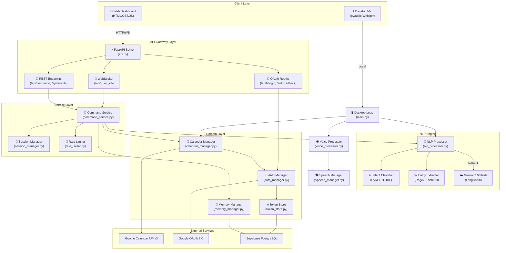
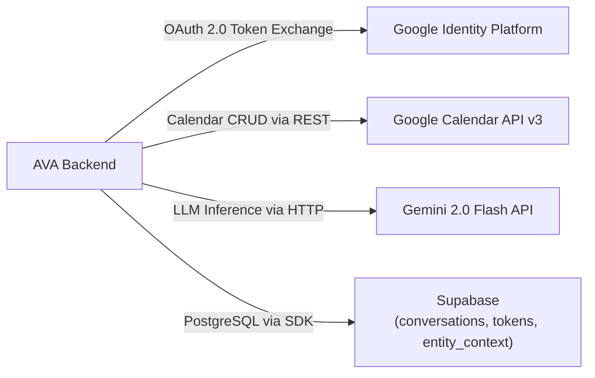
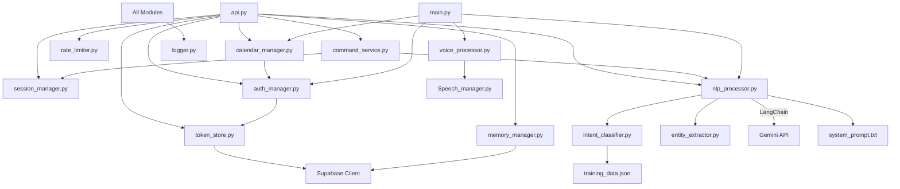
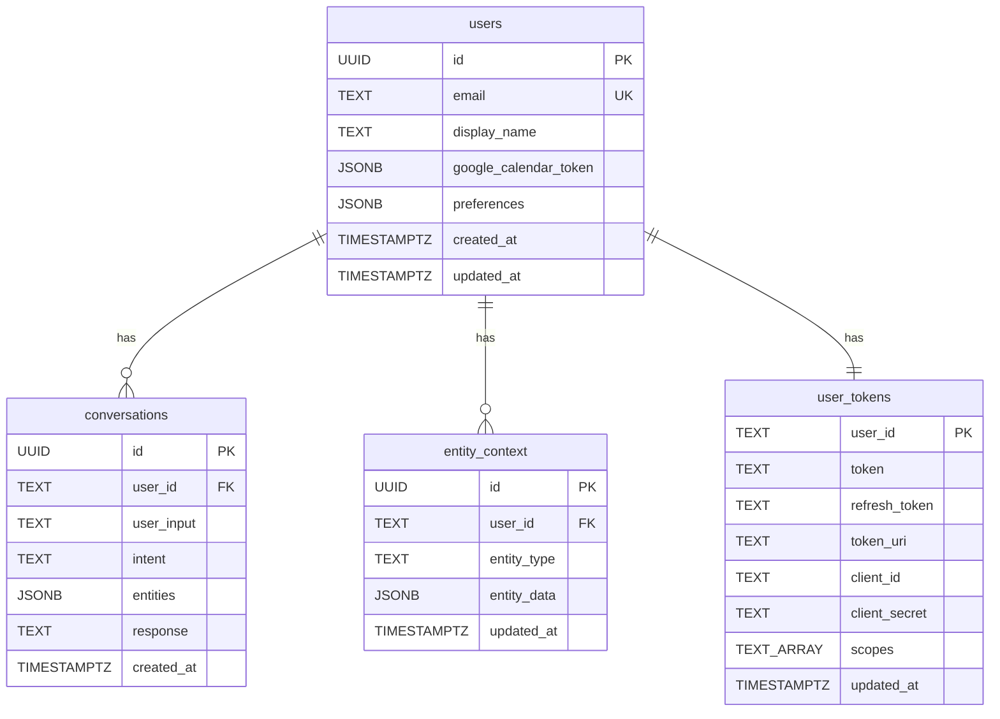
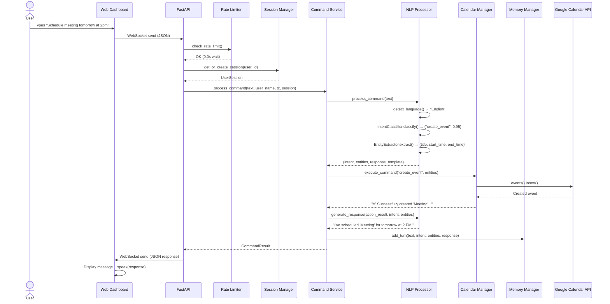
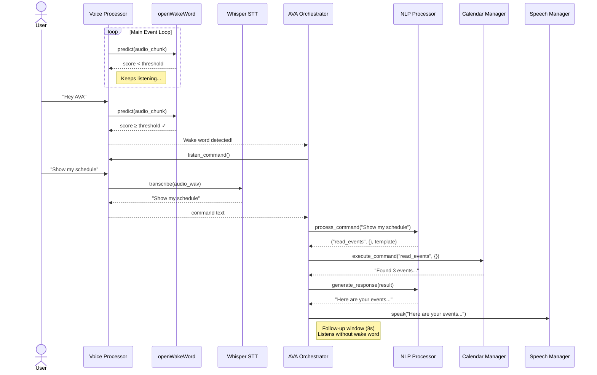
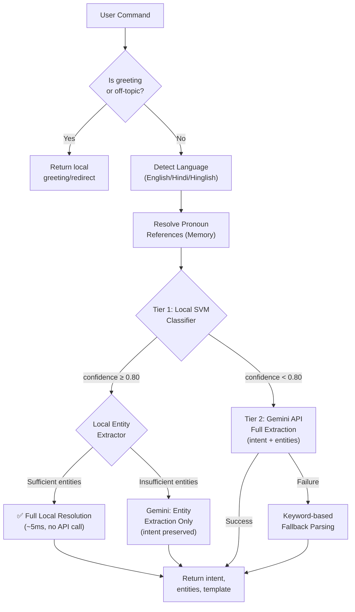
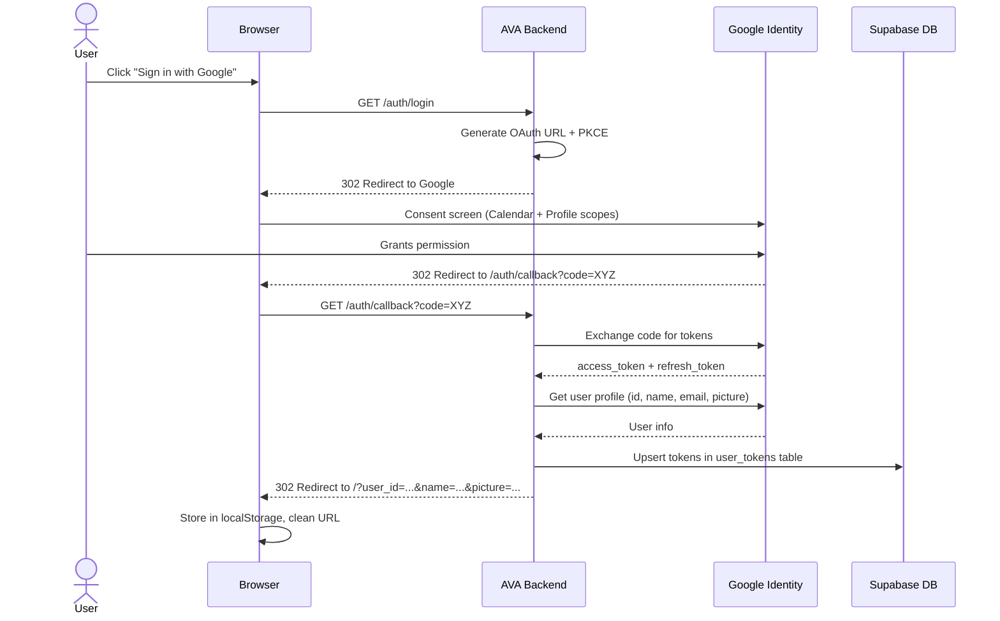

# AVA — Technical Documentation

> **Version:** 2.0.0  
> **Last Updated:** June 2, 2026  
> **Authors:** Rajeev & Contributors  
> **Repository:** [github.com/rajeev0521/project-AVA](https://github.com/rajeev0521/project-AVA)

---

## Table of Contents

1. [Project Overview](#1-project-overview)
2. [High-Level Design (HLD)](#2-high-level-design-hld)
   - [2.1 System Architecture Diagram](#21-system-architecture-diagram)
   - [2.2 Technology Stack](#22-technology-stack)
   - [2.3 External Service Integration](#23-external-service-integration)
   - [2.4 Deployment Architecture](#24-deployment-architecture)
3. [Low-Level Design (LLD)](#3-low-level-design-lld)
   - [3.1 Module Dependency Graph](#31-module-dependency-graph)
   - [3.2 Database Schema (ERD)](#32-database-schema-erd)
   - [3.3 Pydantic Data Models](#33-pydantic-data-models)
   - [3.4 Class Hierarchy](#34-class-hierarchy)
4. [Workflow](#4-workflow)
   - [4.1 Web Mode (REST / WebSocket)](#41-web-mode-rest--websocket)
   - [4.2 Desktop Voice Mode](#42-desktop-voice-mode)
   - [4.3 Two-Tier NLP Pipeline](#43-two-tier-nlp-pipeline)
   - [4.4 OAuth 2.0 Authentication Flow](#44-oauth-20-authentication-flow)
5. [Module Reference — Methodology, Functions & Interconnections](#5-module-reference--methodology-functions--interconnections)
   - [5.1 `api.py` — FastAPI Service Layer](#51-apipy--fastapi-service-layer)
   - [5.2 `main.py` — Desktop Orchestrator](#52-mainpy--desktop-orchestrator)
   - [5.3 `command_service.py` — Unified Command Pipeline](#53-command_servicepy--unified-command-pipeline)
   - [5.4 `nlp_processor.py` — NLP & LLM Integration](#54-nlp_processorpy--nlp--llm-integration)
   - [5.5 `intent_classifier.py` — Local ML Classifier](#55-intent_classifierpy--local-ml-classifier)
   - [5.6 `entity_extractor.py` — Rule-Based Entity Extraction](#56-entity_extractorpy--rule-based-entity-extraction)
   - [5.7 `calendar_manager.py` — Google Calendar Operations](#57-calendar_managerpy--google-calendar-operations)
   - [5.8 `auth_manager.py` — OAuth 2.0 Authentication](#58-auth_managerpy--oauth-20-authentication)
   - [5.9 `token_store.py` — Credential Persistence](#59-token_storepy--credential-persistence)
   - [5.10 `memory_manager.py` — Conversational Memory](#510-memory_managerpy--conversational-memory)
   - [5.11 `session_manager.py` — In-Memory Session Management](#511-session_managerpy--in-memory-session-management)
   - [5.12 `rate_limiter.py` — API Rate Protection](#512-rate_limiterpy--api-rate-protection)
   - [5.13 `voice_processor.py` — Audio Pipeline (Desktop)](#513-voice_processorpy--audio-pipeline-desktop)
   - [5.14 `Speech_manager.py` — Text-to-Speech Engine](#514-speech_managerpy--text-to-speech-engine)
   - [5.15 `logger.py` — Centralized Logging](#515-loggerpy--centralized-logging)
   - [5.16 Frontend (`index.html`, `style.css`, `app.js`)](#516-frontend-indexhtml-stylecss-appjs)
6. [Inter-Module Connection Map](#6-inter-module-connection-map)
7. [Current Features](#7-current-features)
8. [Future Scope](#8-future-scope)

---

## 1. Project Overview

**AVA (AI Voice Assistant)** is a production-grade, voice-activated AI calendar assistant that manages Google Calendar events through natural language commands in both English and Hindi/Hinglish. The system operates in two independent modes:

| Mode | Interface | Use Case |
|------|-----------|----------|
| **Web Mode** | Browser-based glassmorphic dashboard → FastAPI backend | Cloud-deployed multi-user assistant |
| **Desktop Mode** | Local microphone → Whisper STT → pyttsx3 TTS | Offline-first, single-user desktop assistant |

### Core Value Propositions

1. **Hybrid AI Architecture:** A two-tier NLP system that routes simple commands through a local SVM classifier (~5 ms) and complex/ambiguous commands through Google's Gemini 2.0 Flash LLM, minimizing API costs while preserving accuracy.
2. **Bilingual Support:** Full English and Hindi/Hinglish command parsing at every layer — from intent classification training data and entity extraction regex to LLM response generation.
3. **Multi-Turn Conversational Memory:** Supabase-backed conversation history with pronoun resolution (e.g., "move it to 3 PM" resolves "it" to the last referenced event).
4. **Multi-User Isolation:** Per-user OAuth tokens, per-user sessions, per-user memory — all isolated via Supabase Row Level Security (RLS).

---

## 2. High-Level Design (HLD)

### 2.1 System Architecture Diagram



### 2.2 Technology Stack

| Layer | Technology | Version | Rationale |
|-------|-----------|---------|-----------|
| **Backend Framework** | FastAPI | ≥ 0.104 | Async-native Python framework with automatic OpenAPI docs, WebSocket support, and Pydantic integration. Chosen over Flask/Django for native async and high throughput. |
| **LLM Integration** | LangChain + Gemini 2.0 Flash | ≥ 0.3.0 | LangChain provides structured output parsing via Pydantic models, prompt templating, and chain composition. Gemini 2.0 Flash was chosen for its free tier (1,500 RPD), low latency (~1-3s), and structured JSON output quality. |
| **Local ML** | scikit-learn (SGDClassifier + TF-IDF) | ≥ 1.3 | Lightweight, fast (~5 ms inference), no GPU required. Calibrated probabilities allow confidence-based routing to Gemini fallback. |
| **Database** | Supabase (PostgreSQL) | ≥ 2.0 | Managed PostgreSQL with built-in Row Level Security (RLS), real-time subscriptions, and a Python SDK. Eliminates the need for self-hosted DB infrastructure. |
| **Authentication** | Google OAuth 2.0 (PKCE) | — | Industry-standard SSO for accessing Google Calendar API. PKCE flow eliminates the need for client-secret exposure on the frontend. |
| **Calendar API** | Google Calendar API v3 | — | Direct programmatic access to the user's primary Google Calendar with full CRUD capabilities. |
| **Voice (Desktop)** | OpenAI Whisper + openWakeWord + pyttsx3 | — | Whisper provides high-accuracy local STT. openWakeWord enables "Hey AVA" hotword detection. pyttsx3 provides offline TTS without cloud API costs. |
| **Frontend** | Vanilla HTML5 / CSS3 / JavaScript | — | Zero-dependency frontend. Glassmorphic design with Web Speech API for browser-based voice I/O. No framework build step required. |
| **Deployment** | Docker + Render.com | — | Containerized deployment with a single `Dockerfile`. Render.com provides free-tier hosting with automatic SSL, health checks, and auto-deploy from GitHub. |

### 2.3 External Service Integration



### 2.4 Deployment Architecture

| Environment | Configuration | Description |
|-------------|--------------|-------------|
| **Local Development** | `uvicorn ava.api:app --reload` | Hot-reload development server on `localhost:8000`. Frontend served via `python -m http.server 3000`. |
| **Docker** | `docker build -t ava-assistant .` | Single-stage container based on `python:3.10-slim` with system audio libraries for optional desktop mode. |
| **Render.com (Cloud)** | `render.yaml` | Free-tier web service auto-deploying from GitHub with health check at `/health` and environment variable injection. |

---

## 3. Low-Level Design (LLD)

### 3.1 Module Dependency Graph



### 3.2 Database Schema (ERD)

AVA uses four PostgreSQL tables managed by Supabase:



**Row Level Security (RLS):**  
All tables have RLS enabled. Policies ensure each user can only read/write their own rows. The `service_role` key (used server-side) bypasses RLS for administrative operations.

**Indexes:**
| Table | Index | Purpose |
|-------|-------|---------|
| `users` | `idx_users_email` | Fast email lookup during OAuth |
| `conversations` | `idx_conversations_user_time` | Ordered conversation history retrieval |
| `conversations` | `idx_conversations_intent` | Intent-based analytics queries |
| `entity_context` | `idx_entity_context_user` | Fast entity context lookup per user |

### 3.3 Pydantic Data Models

```python
# CalendarIntent — Gemini structured output schema
class CalendarIntent(BaseModel):
    intent: Optional[str]           # "create_event" | "read_events" | "update_event" | "delete_event"
    entities: Dict[str, Any]        # title, start_time (ISO 8601), end_time, event_id, etc.
    response_template: str          # Natural language confirmation phrase

# CommandRequest — REST API request body
class CommandRequest(BaseModel):
    text: str                       # User's command text
    user_id: str                    # Unique user identifier
    user_name: str = "User"         # Display name for personalized responses
    timezone: str = ""              # Client timezone (e.g., "Asia/Kolkata")

# CommandResult — Unified response model
class CommandResult(BaseModel):
    intent: str | None              # Detected intent
    entities: Dict[str, Any]        # Extracted entities
    action_result: str              # Raw calendar API result
    response: str                   # Natural language response
    used_local_classifier: bool     # True if SVM was used, False if Gemini
```

### 3.4 Class Hierarchy

```
ava/
├── AVA                        # Desktop mode orchestrator
│   └── AVASession             # Multi-turn session state tracker
│
├── NLPProcessor               # Two-tier NLP engine
│   ├── IntentClassifier       # Local SVM classifier
│   └── EntityExtractor        # Regex-based entity parser
│
├── CalendarManager            # Google Calendar CRUD operations
├── AuthManager                # OAuth 2.0 flow manager
├── SupabaseTokenStore         # Per-user credential persistence
├── MemoryManager              # Conversational memory + reference resolution
├── SessionManager             # LRU+TTL in-memory session pool
│   └── UserSession            # Per-user session data container
├── CommandService             # Unified REST/WS command pipeline
│   └── CommandResult          # Response data model
├── RateLimiter                # Sliding-window rate limiter
│   └── RateLimitExceeded      # Exception class
├── VoiceProcessor             # Wake word + Whisper STT
└── Speech_manager (module)    # Threaded pyttsx3 TTS
```

---

## 4. Workflow

### 4.1 Web Mode (REST / WebSocket)



### 4.2 Desktop Voice Mode



### 4.3 Two-Tier NLP Pipeline

This is the core architectural decision of AVA. Instead of routing every command to a cloud LLM (which is slow, expensive, and rate-limited), AVA uses a two-tier classification system:



**Why This Architecture?**

| Concern | Solution | Rationale |
|---------|----------|-----------|
| **Latency** | Local SVM (~5ms) handles ~70-80% of commands | Users expect sub-second responses for simple commands like "show my schedule" |
| **Cost** | Gemini free tier has 1,500 RPD limit | Local classification preserves API budget for complex/ambiguous queries |
| **Accuracy** | Confidence threshold (0.80) gates API fallback | Low-confidence local predictions are automatically routed to Gemini for higher accuracy |
| **Resilience** | Keyword-based fallback parsing | Even if both SVM and Gemini fail, the system can still process basic commands |

### 4.4 OAuth 2.0 Authentication Flow



---

## 5. Module Reference — Methodology, Functions & Interconnections

---

### 5.1 `api.py` — FastAPI Service Layer

**Purpose:** Entry point for the web application. Defines all HTTP endpoints, WebSocket handlers, CORS middleware, and application lifecycle management.

**Why FastAPI?**  
FastAPI was chosen over Flask/Django because it provides native `async/await` support (critical for non-blocking WebSocket handlers), automatic OpenAPI/Swagger documentation generation at `/docs`, built-in Pydantic request validation, and high throughput under concurrent connections.

**Lifecycle Management:**  
Uses FastAPI's `@asynccontextmanager` lifespan to initialize global resources (Supabase client, AuthManager, RateLimiter, SessionManager, NLPProcessor, CommandService) once at startup and clean up on shutdown. This avoids reinitializing expensive resources on every request.

| Function / Route | Type | Description | Connected To |
|-----------------|------|-------------|--------------|
| `lifespan(app)` | Lifecycle | Initializes all global singletons (Supabase, AuthManager, RateLimiter, SessionManager, NLPProcessor, CommandService) | All service modules |
| `GET /health` | Endpoint | Returns server status, API version, remaining daily quota | `RateLimiter` |
| `GET /api/stats` | Endpoint | Returns active sessions, total sessions, daily API remaining, rate limiter status | `SessionManager`, `RateLimiter` |
| `POST /api/command` | Endpoint | Processes a natural language command via REST | `RateLimiter`, `SessionManager`, `CommandService` |
| `WS /ws/{user_id}` | WebSocket | Bi-directional persistent connection for real-time command processing | `RateLimiter`, `SessionManager`, `CommandService` |
| `GET /api/events` | Endpoint | Returns upcoming calendar events for the next 7 days | `SessionManager`, `CalendarManager` |
| `GET /auth/login` | Endpoint | Redirects to Google OAuth consent screen | `AuthManager` |
| `GET /auth/callback` | Endpoint | Handles Google OAuth callback, saves tokens, redirects to frontend | `AuthManager`, `SupabaseTokenStore` |
| `GET /auth/logout` | Endpoint | Clears session and redirects to home | — |
| `_get_or_create_session(user_id)` | Helper | Retrieves or creates a `UserSession` with associated `MemoryManager` and `CalendarManager` | `SessionManager`, `MemoryManager`, `CalendarManager` |

---

### 5.2 `main.py` — Desktop Orchestrator

**Purpose:** Entry point for the desktop voice mode. Orchestrates the continuous wake-word-listen-process-respond loop.

**Why a Separate Orchestrator?**  
Desktop mode requires blocking audio I/O (microphone capture, TTS playback) which is incompatible with FastAPI's async event loop. A dedicated synchronous orchestrator keeps the two modes cleanly separated.

**Classes:**

#### `AVASession`
Tracks multi-turn desktop session state:
- `awaiting_confirmation` — Whether the system is waiting for a yes/no answer
- `pending_action` / `pending_data` — Stores the pending operation (e.g., bulk delete)
- `last_response_time` — Timestamp used to implement an 8-second follow-up window (listen without wake word after a response)

#### `AVA`
Main orchestrator class:

| Method | Description | Connected To |
|--------|-------------|--------------|
| `__init__()` | Initializes AuthManager, VoiceProcessor, CalendarManager, MemoryManager, NLPProcessor | All backend modules |
| `_init_memory()` | Conditionally initializes Supabase MemoryManager (graceful fallback if not configured) | `MemoryManager` |
| `start()` | Main event loop: checks confirmation state → checks follow-up window → listens for wake word → processes command | `VoiceProcessor`, `NLPProcessor`, `CalendarManager` |
| `_process_command(command)` | Runs the NLP pipeline, executes calendar operation, generates response, speaks it, stores in memory | `NLPProcessor`, `CalendarManager`, `VoiceProcessor`, `MemoryManager` |
| `_handle_confirmation(command)` | Handles yes/no responses for bulk operations. Supports English and Hindi confirmations. | `CalendarManager`, `VoiceProcessor` |
| `_clear_confirmation()` | Resets confirmation state machine | — |

---

### 5.3 `command_service.py` — Unified Command Pipeline

**Purpose:** Provides a single, reusable pipeline for processing natural language commands. Used by both REST and WebSocket endpoints to eliminate code duplication.

**Why a Separate Service?**  
Without this, the REST handler and WebSocket handler would duplicate the same 6-step pipeline (set context → extract intent → execute calendar → handle confirmations → generate response → update memory). This violates DRY and makes bug fixes harder.

**Classes:**

#### `CommandResult(BaseModel)`
Pydantic model for the standardized response:
- `intent`, `entities`, `action_result`, `response`, `used_local_classifier`

#### `CommandService`

| Method | Description | Connected To |
|--------|-------------|--------------|
| `__init__(nlp_processor)` | Takes a shared NLPProcessor instance | `NLPProcessor` |
| `process_command(text, user_name, timezone_str, session)` | Full 6-step pipeline: set context → NLP → calendar → confirmation check → response generation → memory update. Uses `asyncio.to_thread()` for blocking operations. | `NLPProcessor`, `CalendarManager`, `MemoryManager`, `SessionManager` |
| `_handle_confirmation(text, session)` | Handles yes/no responses for pending bulk operations. Supports bilingual confirmation words. | `CalendarManager` |
| `_clear_confirmation(session)` | Resets confirmation state on a `UserSession` | `SessionManager` |

**Why `asyncio.to_thread()`?**  
NLP processing (SVM inference, Gemini API calls) and Google Calendar API calls are blocking I/O operations. Running them directly in the FastAPI async event loop would block all other concurrent requests. `asyncio.to_thread()` offloads them to a thread pool, keeping the event loop responsive.

---

### 5.4 `nlp_processor.py` — NLP & LLM Integration

**Purpose:** Core intelligence module. Handles language detection, intent extraction, entity parsing, response generation, and bilingual support.

**Why LangChain + Structured Output?**  
LangChain's `with_structured_output(CalendarIntent)` forces Gemini to return a Pydantic-validated JSON object instead of free-form text. This eliminates fragile JSON parsing and guarantees type safety. The `PromptTemplate` system allows injecting dynamic context (timezone, conversation history, language) into every LLM call.

#### `NLPProcessor`

| Method | Description | Methodology |
|--------|-------------|-------------|
| `__init__(user_name, memory_manager, llm, user_timezone)` | Initializes Gemini LLM, structured output parser, timezone, and lazy-loaded local classifiers | LangChain `ChatGoogleGenerativeAI` + `with_structured_output()` |
| `set_user_name(name)` | Dynamically updates username with XSS sanitization | `html.escape()` prevents reflected XSS |
| `set_timezone(timezone_str)` | Updates timezone from client-provided value | `pytz.timezone()` |
| `detect_language(text)` | Auto-detects English/Hindi/Hinglish by checking Devanagari Unicode (`U+0900–U+097F`) and a set of 40+ Hindi marker words. Returns language label based on ratio thresholds. | Unicode block detection + word-frequency ratio (>0.4 = Hindi, >0.15 = Hinglish) |
| `get_dynamic_tone(intent)` | Maps intent to response tone: create→professional, read→friendly, update→helpful, delete→careful | Static mapping dict |
| `is_greeting(command)` | Checks against 15+ greeting patterns (English + Hindi) | Pattern matching |
| `is_off_topic(command)` | Checks against off-topic patterns (weather, jokes, etc.) to redirect users | Pattern matching |
| `process_command(command)` | **Main entry point.** Greeting/off-topic check → language detection → reference resolution → Tier 1 local classifier → Tier 2 Gemini fallback | Two-tier pipeline |
| `_gemini_extract(command, language)` | Full Gemini API extraction (intent + entities + response_template) | LangChain chain: `PromptTemplate → intent_parser` |
| `_gemini_extract_entities_only(command, local_intent, language, tone)` | Uses Gemini only for entity extraction when local intent is confident but entities are incomplete | Hybrid local+cloud approach |
| `_local_response_template(intent, entities, language)` | Generates response templates locally without any API call, in English or Hindi/Hinglish | Template strings with dynamic insertion |
| `_validate_and_fix_times(entities)` | Strips timezone suffixes, re-localizes to user's timezone, converts back to ISO 8601 | Defensive timezone normalization |
| `_fallback_parsing(command, language)` | Last-resort keyword-based intent detection and regex time extraction when both SVM and Gemini fail | Keyword matching + regex |
| `generate_response(action_result, intent, entities, response_template)` | Generates the final user-facing response. Detects negative results (errors, empty) and returns them directly without prepending success templates. | Negative-result detection + template personalization |
| `_local_generate_response(action_result, intent, entities)` | Fully local response generation with bilingual support | Template strings, no API call |

**Connected To:** `IntentClassifier`, `EntityExtractor`, `MemoryManager`, Gemini API (via LangChain), `system_prompt.txt`

---

### 5.5 `intent_classifier.py` — Local ML Classifier

**Purpose:** Fast, offline intent classification using a trained SVM model. Handles ~70-80% of commands without any API call.

**Why SVM + TF-IDF (Not a Neural Network)?**
- **Speed:** ~5ms inference vs. ~1-3s for an LLM API call
- **No GPU Required:** Runs on any CPU, even in free-tier cloud containers
- **Small Footprint:** Trained model is ~200 KB (vs. hundreds of MB for a transformer)
- **Calibrated Probabilities:** The `CalibratedClassifierCV` wrapper with sigmoid calibration produces reliable confidence scores, enabling the 0.80 threshold routing decision
- **Bilingual Robustness:** Word-level TF-IDF with `ngram_range=(1,3)` captures Hindi/Hinglish transliteration patterns without needing a multilingual embedding model

**Why SGDClassifier with `modified_huber` Loss?**  
`modified_huber` loss provides native probability estimates (unlike hinge loss) while maintaining the speed of stochastic gradient descent. `class_weight='balanced'` handles class imbalance in the training data.

#### `IntentClassifier`

| Method | Description |
|--------|-------------|
| `__init__(training_data_path, model_path)` | Loads pre-trained model from `intent_model.pkl` or trains a new one from `training_data.json` |
| `_load_or_train()` | Checks for existing pickled model → loads or retrains |
| `_train()` | Builds a `Pipeline[TfidfVectorizer → CalibratedClassifierCV(SGDClassifier)]`, fits on bilingual training data (211 examples across 4 intents), saves to disk |
| `classify(text)` | Returns `(intent_name, confidence_score)` — confidence is 0.0 to 1.0 |
| `retrain()` | Deletes saved model and retrains from latest `training_data.json` |

**Training Data:** `training_data.json` contains 211 bilingual examples:
- `create_event`: 52 examples (English + Hindi)
- `read_events`: 51 examples
- `delete_event`: 51 examples
- `update_event`: 47 examples

**Connected To:** `NLPProcessor` (lazy-loaded property)

---

### 5.6 `entity_extractor.py` — Rule-Based Entity Extraction

**Purpose:** Extracts structured entities (title, start_time, end_time, date, location) from natural language using regex patterns and the `dateutil` library.

**Why Rule-Based (Not ML)?**
- **Deterministic:** Regex patterns produce consistent, predictable results for well-structured temporal expressions
- **Zero Latency:** No model loading or inference time
- **No Training Data Needed:** Temporal patterns (dates, times) follow strict grammatical rules that are better captured by regex than statistical models
- **Bilingual Support:** Hindi time words (`baje`, `subah`, `shaam`, `raat`, `dopahar`) are easily added as regex patterns

#### `EntityExtractor`

| Method | Description |
|--------|-------------|
| `__init__(local_tz)` | Initializes with local timezone for date calculations |
| `extract(command, intent)` | Main entry point — extracts title, dates, times, and date ranges based on intent |
| `_extract_title(command, intent)` | Multi-strategy title extraction: explicit patterns ("called X", "titled X") → keyword matching → default |
| `_extract_title_around_keyword(command, keyword)` | Captures multi-word titles by expanding outward from a keyword, stopping at stop words |
| `_clean_title(title)` | Strips stop words from title edges |
| `_extract_date(command)` | Extracts dates via: relative days ("tomorrow", "kal") → day names ("next Monday") → dateutil parser → default to today. Handles year inference for past dates. |
| `_extract_times(command, target_date)` | Extracts start/end times via 4 patterns: `X:YY am/pm`, `X baje` (Hindi), 24-hour format, `noon/midnight`. Defaults to 1-hour duration if only start time found. |
| `_extract_date_range(command)` | Extracts temporal ranges for `read_events`: past expressions ("last week", "yesterday"), explicit ranges ("between X and Y"), relative expressions ("this week", "next week", "this month", "weekend") |

**Supported Temporal Patterns:**
| Pattern | Example | Language |
|---------|---------|----------|
| Relative days | "tomorrow", "day after tomorrow" | English |
| Hindi relative | "kal", "aaj", "parso" | Hindi |
| Day names | "next Monday", "this Friday" | English |
| Hindi days | "somvar", "mangalvar" | Hindi |
| AM/PM time | "2:30 PM", "10am" | English |
| Hindi time | "3 baje", "subah 9 baje" | Hindi |
| 24-hour | "14:00", "09:30" | Universal |
| Date strings | "June 5th", "5th June 2026" | English |
| Past ranges | "last week", "last 3 days" | English |
| Hindi past | "pichle hafte", "pichla mahina" | Hindi |

**Connected To:** `NLPProcessor` (lazy-loaded property)

---

### 5.7 `calendar_manager.py` — Google Calendar Operations

**Purpose:** Provides complete CRUD operations against the Google Calendar API v3 with comprehensive validation, conflict detection, and multi-strategy event identification.

**Why a Dedicated Manager?**  
Calendar operations involve complex validation (time logic, conflict detection, past-event checks, duration limits), multi-strategy event lookup (by ID, title, date, time range), and bulk operations with confirmation flows. Encapsulating this in a single class provides a clean interface for both web and desktop modes.

#### `CalendarManager`

| Method | Description |
|--------|-------------|
| `__init__(auth_manager, user_id)` | Stores auth manager reference and user ID for per-user calendar access |
| `_get_calendar_service()` | Builds a Google Calendar API service object using the user's OAuth credentials |
| `execute_command(intent, entities)` | Routes to the correct CRUD method based on intent |
| `read_events(entities)` | Public method for the `/api/events` endpoint |
| `_validate_datetime(datetime_str)` | Parses and validates datetime strings/objects, attaches local timezone if missing. Handles ISO 8601, UTC `Z` suffix, and naive datetimes. |
| `_format_datetime_for_api(dt)` | Formats datetime to ISO 8601 with timezone for Google Calendar API |
| `_format_datetime_for_display(datetime_str)` | Human-readable format: "Monday, June 03, 2026 at 02:00 PM" |
| `_create_event(service, entities)` | Creates an event with validation: required fields check → time parsing → past-event check → duration validation (1 min to 7 days) → conflict detection → API insert. Supports optional description, location, attendees. |
| `_read_events(service, entities)` | Reads events with flexible time range: defaults to 7 days if no range specified, single day if only start time given. Formats output with emojis (📅📍🏢). |
| `_update_event(service, entities)` | Updates events with smart identification (by ID or by title+date). Tracks changes and auto-adjusts end time when only start time changes. Validates updated time logic. |
| `_delete_event(service, entities)` | Multi-strategy deletion: by event ID → by title+date → by time range (with confirmation) → by date → error message |
| `_delete_by_id(service, event_id)` | Direct deletion by Google Calendar event ID |
| `_delete_by_ids(service, event_ids)` | Bulk deletion for confirmed operations |
| `_delete_by_title_and_date(service, title, date_str)` | Finds event by title and optional date, deletes if exactly one match found |
| `_delete_by_time_range(service, start_time, end_time)` | Lists all events in range, returns confirmation prompt with event titles and IDs |
| `_delete_by_date(service, date_str)` | Deletes all events on a specific date (delegates to `_delete_by_time_range`) |
| `_find_events_by_title(service, title, date_str)` | Searches events using Google's `q` parameter with case-insensitive title matching |
| `_find_event_by_title_and_date(service, title, date_str, fallback_date)` | Returns event ID if exactly one match found |
| `_check_for_conflicts(service, start_time, end_time)` | Checks for overlapping events in the proposed time range |
| `_get_time_range_description(start_time, end_time)` | Human-readable time range: "on June 03, 2026" or "from June 01 to June 07" |

**Validation Rules:**
| Rule | Enforcement |
|------|-------------|
| Start time must be before end time | Returns error message |
| Event cannot be in the past (5-min buffer) | Returns warning message |
| Duration must be ≥ 1 minute | Returns error message |
| Duration must be ≤ 7 days | Returns warning message |
| Conflict detection | Returns note in success message |

**Connected To:** `AuthManager` (for per-user calendar service)

---

### 5.8 `auth_manager.py` — OAuth 2.0 Authentication

**Purpose:** Manages the complete Google OAuth 2.0 lifecycle: authorization URL generation, code exchange, token refresh, user profile retrieval, and per-user Calendar API service construction.

**Why OAuth 2.0 with Offline Access?**  
`access_type="offline"` ensures Google returns a `refresh_token` alongside the `access_token`. The refresh token allows AVA to maintain calendar access even when the user is not actively logged in, enabling background operations without requiring re-authentication.

**OAuth Scopes:**
| Scope | Purpose |
|-------|---------|
| `openid` | OpenID Connect identification |
| `userinfo.profile` | User name and profile picture |
| `userinfo.email` | User email address |
| `calendar` | Full read/write access to Google Calendar |

#### `AuthManager`

| Method | Description |
|--------|-------------|
| `__init__(token_store)` | Initializes with a token store and loads OAuth client credentials from environment variables |
| `_client_config()` | Builds the OAuth client config dict for `google_auth_oauthlib.Flow` |
| `get_authorization_url(state)` | Generates Google consent screen URL with offline access and consent prompt. Returns `(url, code_verifier)`. |
| `exchange_code(code, code_verifier)` | Exchanges authorization code for OAuth credentials. Supports PKCE. |
| `get_user_info(credentials)` | Fetches user profile (id, email, name, picture) from Google's OAuth2 v2 API |
| `get_credentials(user_id)` | Loads credentials from token store, auto-refreshes if expired, saves refreshed credentials back |
| `get_calendar_service(user_id)` | Builds a `googleapiclient.discovery` Resource for Calendar v3 API |

**Helper Function:**
| Function | Description |
|----------|-------------|
| `creds_to_dict(creds)` | Serializes a `google.oauth2.credentials.Credentials` object to a storable dict |

**Connected To:** `SupabaseTokenStore` (persistence), `CalendarManager` (service construction)

---

### 5.9 `token_store.py` — Credential Persistence

**Purpose:** Provides secure, per-user OAuth token storage backed by Supabase PostgreSQL. Implements the storage interface expected by `AuthManager`.

**Why Supabase Instead of Local File Storage?**  
Multi-user web deployments cannot use local file-based token storage (e.g., `token.json`). Supabase provides encrypted-at-rest PostgreSQL with RLS, ensuring each user's tokens are isolated and only accessible via the service role key.

#### `SupabaseTokenStore`

| Method | Description |
|--------|-------------|
| `__init__(supabase_client)` | Stores reference to the shared Supabase client |
| `save(user_id, creds_dict)` | Upserts OAuth credentials (token, refresh_token, token_uri, client_id, client_secret, scopes) into `user_tokens` table |
| `load(user_id)` | Loads credentials for a user. Returns `None` if not found. |
| `delete(user_id)` | Deletes stored credentials (used on logout/revoke) |
| `exists(user_id)` | Checks if credentials exist for a user |

**Connected To:** `AuthManager`, Supabase PostgreSQL

---

### 5.10 `memory_manager.py` — Conversational Memory

**Purpose:** Provides persistent conversational memory with conversation history, entity context tracking, and pronoun/reference resolution.

**Why Conversational Memory?**  
Without memory, every command is processed in isolation. The user cannot say "move it to 3 PM" after creating an event — the system wouldn't know what "it" refers to. Memory enables:
1. **Multi-turn conversations:** Context from previous turns is injected into LLM prompts
2. **Reference resolution:** Pronouns ("it", "that", "woh") are resolved to the last referenced event
3. **User preference learning:** Analyzes past interactions to learn typical meeting durations

#### `MemoryManager`

| Method | Description |
|--------|-------------|
| `__init__(supabase_client, user_id)` | Initializes with Supabase client, loads recent history into in-memory cache |
| `_load_session_history(limit)` | Loads the last N conversation turns from Supabase into `_conversation_cache`. Restores entity context from the most recent turn. |
| `add_turn(user_input, intent, entities, response)` | Stores a conversation turn in both the local cache and Supabase. Trims cache to `MAX_CONTEXT_TURNS` (10). Updates entity context. |
| `_update_entity_context(entities)` | Upserts the last referenced event entities in the `entity_context` table |
| `get_context_prompt()` | Builds a formatted conversation history string for LLM prompt injection. Includes user input, AVA response, and key entity context per turn. |
| `resolve_reference(command)` | Detects pronouns/references ("it", "that meeting", "woh", "usse") and appends entity context from the last event. E.g., "move it to 3 PM" → "move it to 3 PM (referring to event: 'Team Meeting')" |
| `get_user_preferences()` | Analyzes the last 20 `create_event` turns to learn average meeting duration |
| `clear_context()` | Clears the current entity context cache |

**Cache Strategy:**  
Uses an in-memory `List[Dict]` cache (max 10 turns) to avoid database round-trips on every request. The cache is populated from Supabase on initialization and updated on every `add_turn()`.

**Connected To:** `NLPProcessor` (context injection + reference resolution), `CommandService` (turn storage), Supabase PostgreSQL

---

### 5.11 `session_manager.py` — In-Memory Session Management

**Purpose:** Manages per-user sessions in memory with LRU (Least Recently Used) eviction and TTL (Time-To-Live) expiration to prevent memory leaks in multi-user deployments.

**Why In-Memory (Not Redis)?**  
For the current single-instance deployment, in-memory sessions avoid the operational complexity of running a Redis instance. The architecture is designed to be swappable — the `SessionManager` interface can be backed by Redis for horizontal scaling without changing the consuming code.

**Eviction Strategy:**
- **LRU:** When `max_sessions` (100) is reached, the least recently accessed session is evicted
- **TTL:** Sessions idle for more than `ttl_seconds` (1800s = 30 min) are automatically evicted

#### `UserSession`
Per-user session data container:
- `user_id`, `memory_manager`, `calendar_manager`
- `awaiting_confirmation`, `pending_action`, `pending_data` — Confirmation state machine
- `last_active` — Monotonic timestamp for TTL eviction

#### `SessionManager`

| Method | Description |
|--------|-------------|
| `__init__(max_sessions, ttl_seconds)` | Initializes with capacity and TTL limits |
| `get_session(user_id)` | Retrieves session, updates `last_active`, moves to end of `OrderedDict` (most recently used). Returns `None` if expired/missing. |
| `create_session(user_id, memory_manager, calendar_manager)` | Creates new session or updates existing. Evicts LRU if at capacity. |
| `_evict_expired_nolock()` | Iterates sessions and removes those past TTL. Called internally with lock held. |
| `get_stats()` | Returns `{active_sessions, max_sessions, ttl_seconds}` for the `/api/stats` endpoint |

**Thread Safety:** All operations are protected by `threading.Lock` since FastAPI runs handler code in thread pools via `asyncio.to_thread()`.

**Connected To:** `api.py`, `CommandService`

---

### 5.12 `rate_limiter.py` — API Rate Protection

**Purpose:** Implements a sliding-window rate limiter to keep AVA within Gemini's free-tier limits: 15 requests per minute (RPM) and 1,500 requests per day (RPD).

**Why Sliding Window (Not Fixed Window)?**  
A fixed window resets at specific time boundaries (e.g., every minute on the minute), creating "burst" windows where a user could make 30 requests in 2 seconds by timing requests around the reset boundary. A sliding window tracks individual request timestamps, providing smooth, consistent rate limiting.

**Implementation:**  
Uses a `collections.deque` to store monotonic timestamps of requests in the last 60 seconds. Expired entries are lazily pruned on each `check_rate_limit()` call.

#### `RateLimiter`

| Method | Description |
|--------|-------------|
| `__init__(max_rpm, max_rpd)` | Initializes with configurable RPM and RPD limits |
| `check_rate_limit()` | Non-blocking check. Returns seconds to wait (0.0 if OK). Raises `RateLimitExceeded` if daily limit hit. Auto-resets daily counter at midnight. |
| `wait_if_needed()` | Blocking wait for sync callers (desktop mode). Uses `time.sleep()`. |
| `wait_if_needed_async()` | Async wait for FastAPI handlers. Uses `asyncio.sleep()` to avoid blocking the event loop. |
| `record_request()` | Records a request timestamp. Logs warnings when RPM ≤ 3 or RPD ≤ 100. |
| `daily_remaining` (property) | Returns remaining daily quota |
| `can_make_request` (property) | Returns `True` if a request can be made without waiting |

#### `RateLimitExceeded(Exception)`
Custom exception raised when the daily limit is exhausted. Caught by `api.py` to return HTTP 429.

**Connected To:** `api.py` (middleware-like usage in endpoint handlers)

---

### 5.13 `voice_processor.py` — Audio Pipeline (Desktop)

**Purpose:** Handles the complete desktop audio pipeline: wake word detection via openWakeWord, voice-to-text via OpenAI Whisper, and TTS output delegation.

**Why openWakeWord + Whisper (Not Cloud STT)?**
- **Privacy:** Audio never leaves the user's device
- **Latency:** Local processing is faster than network round-trips
- **Cost:** No per-request API charges for speech recognition
- **Offline:** Works without internet (except for Gemini NLP calls)

**Key Optimizations:**
| Optimization | Description | Impact |
|-------------|-------------|--------|
| One-time Whisper model load | Model loaded once at `__init__`, reused for all transcriptions | Saves ~2-5s per command (model load time) |
| One-time ambient noise calibration | `adjust_for_ambient_noise()` called once at startup | Saves ~1s per command (calibration time) |
| Configurable wake word threshold | `WAKE_WORD_THRESHOLD` env var (default 0.5) | Tunable sensitivity vs. false-positive rate |
| Debug log throttling | Volume/score logs emitted every 5s instead of every frame | Prevents log flooding during idle listening |

#### `VoiceProcessor`

| Method | Description |
|--------|-------------|
| `__init__()` | Downloads openWakeWord models, loads wake word model (custom `hey_ava.onnx` or fallback `hey jarvis`), loads Whisper model, calibrates ambient noise |
| `_calibrate_noise()` | One-time ambient noise calibration using `speech_recognition.Recognizer.adjust_for_ambient_noise()` |
| `detect_wake_word()` | Continuously reads 80ms audio chunks from PyAudio, feeds to openWakeWord model, returns `True` when any model score exceeds threshold |
| `listen_command()` | Records audio via `speech_recognition.Microphone`, saves to temp WAV file, transcribes with pre-loaded Whisper model, returns text |
| `speak(text, blocking)` | Delegates to `Speech_manager.speak()` |

**Connected To:** `Speech_manager`, `main.py` (AVA orchestrator)

---

### 5.14 `Speech_manager.py` — Text-to-Speech Engine

**Purpose:** Provides non-blocking text-to-speech using the system's native TTS engine via pyttsx3.

**Why pyttsx3 (Not Cloud TTS)?**
- **Offline:** No internet required
- **Zero Cost:** No per-character API charges
- **Low Latency:** Direct system audio output

**Why Lazy Initialization?**  
The TTS engine crashes on systems without audio devices (e.g., headless servers, CI/CD containers) if initialized at import time. Lazy initialization via `_get_engine()` defers the crash until TTS is actually needed, allowing the rest of the system to function normally.

**Thread Safety:**  
Uses a `threading.Lock` (`_engine_lock`) to prevent concurrent access to the pyttsx3 engine, which is not thread-safe.

| Function | Description |
|----------|-------------|
| `_get_engine()` | Lazy-initializes the pyttsx3 TTS engine (double-checked locking pattern) |
| `speak(text, blocking)` | If `blocking=True`, speaks synchronously. If `blocking=False`, spawns a daemon thread for non-blocking playback. |
| `_speak_sync(text)` | Synchronous TTS execution with engine lock |

**Connected To:** `VoiceProcessor` (desktop mode)

---

### 5.15 `logger.py` — Centralized Logging

**Purpose:** Provides a consistent, structured logging configuration across all modules with dual output (console + file).

**Why Centralized Logging?**  
Ensures all modules use the same log format, timestamp format, and output destinations. Prevents duplicate handler registration (checks `logger.handlers` before adding).

| Function | Description |
|----------|-------------|
| `get_logger(name, level)` | Creates and returns a configured logger with console handler (stdout) and file handler (`logs/ava.log`). Format: `[2026-06-02 12:30:00] [INFO   ] [module_name] Message` |

**Log Destinations:**
| Destination | Level | Purpose |
|-------------|-------|---------|
| Console (stdout) | DEBUG | Real-time monitoring during development |
| File (`logs/ava.log`) | DEBUG | Persistent log storage for post-mortem debugging |

**Connected To:** Every module in the project

---

### 5.16 Frontend (`index.html`, `style.css`, `app.js`)

**Purpose:** A modern glassmorphic web dashboard providing chat-based interaction, voice input/output via the Web Speech API, Google OAuth login, and real-time API stats.

**Why Vanilla JS (No Framework)?**
- **Zero build step:** No npm, webpack, or bundler required
- **Fast loading:** No framework overhead
- **Simplicity:** The frontend is a single-page dashboard with chat, not a complex SPA
- **Portability:** Can be served from any static file server

#### Frontend Architecture

| File | Responsibility |
|------|---------------|
| `index.html` | Page structure: login screen, main app layout, chat container, command input, quick action buttons, user profile, connection status |
| `style.css` | Glassmorphic design system: `backdrop-filter: blur()`, gradient backgrounds, animated typing indicators, responsive layout, message bubbles |
| `app.js` | Application logic: OAuth redirect handling, WebSocket connection management, Web Speech API (STT + TTS), REST fallback, UI state management |

#### Key `app.js` Functions

| Function | Description | Connected To |
|----------|-------------|--------------|
| `checkAuthState()` | Shows login/main screen based on `localStorage` auth state | OAuth callback params |
| `logout()` | Clears localStorage, redirects to `/auth/logout` | `api.py` |
| `initWebSocket()` | Opens persistent WebSocket to `/ws/{user_id}` with auto-reconnect (3s) | `api.py` WebSocket endpoint |
| `updateConnectionStatus(connected)` | Updates UI badge (green/red dot + text) | — |
| `initSpeechRecognition()` | Initializes Web Speech API with `en-IN` locale (supports Hindi words). Handles interim/final results. | Browser API |
| `toggleVoice()` / `startListening()` / `stopListening()` | Mic toggle with UI state updates | — |
| `speak(text)` | Browser TTS via `SpeechSynthesisUtterance`. Selects natural-sounding voice. | Browser API |
| `sendCommand()` | Sends command via WebSocket (primary) or REST (fallback) | `api.py` |
| `sendViaRest(text)` | `fetch()` to `POST /api/command` with error handling | `api.py` |
| `handleResponse(data)` | Processes server response: displays message, triggers TTS, updates stats | — |
| `addMessage(text, sender, meta)` | Renders chat bubble with avatar, timestamp, intent badge, and LOCAL indicator | — |
| `showTypingIndicator()` / `hideTypingIndicator()` | Animated typing dots while waiting for response | — |
| `escapeHtml(text)` | XSS prevention for user-generated content | — |
| `initKeyboardShortcuts()` | Enter to send, Ctrl+M for mic toggle, auto-focus on typing | — |
| `fetchApiStats()` | Polls `GET /api/stats` every 30s, updates remaining API calls display | `api.py` |

---

## 6. Inter-Module Connection Map

The following table shows how each module depends on other modules:

| Module | Depends On | Used By |
|--------|-----------|---------|
| `api.py` | `command_service`, `session_manager`, `rate_limiter`, `auth_manager`, `token_store`, `memory_manager`, `calendar_manager`, `nlp_processor`, `logger` | Frontend (HTTP/WS) |
| `main.py` | `voice_processor`, `calendar_manager`, `nlp_processor`, `auth_manager`, `memory_manager`, `logger` | CLI entry point |
| `command_service.py` | `nlp_processor`, `session_manager`, `logger` | `api.py` |
| `nlp_processor.py` | `intent_classifier`, `entity_extractor`, `memory_manager`, `logger`, `system_prompt.txt`, LangChain/Gemini | `command_service`, `main.py` |
| `intent_classifier.py` | `training_data.json`, `logger`, scikit-learn | `nlp_processor` |
| `entity_extractor.py` | `logger`, dateutil | `nlp_processor` |
| `calendar_manager.py` | `auth_manager`, `logger`, Google Calendar API | `command_service`, `main.py`, `api.py` |
| `auth_manager.py` | `token_store`, `logger`, Google OAuth libraries | `api.py`, `main.py`, `calendar_manager` |
| `token_store.py` | `logger`, Supabase client | `auth_manager` |
| `memory_manager.py` | `logger`, Supabase client | `command_service`, `main.py`, `nlp_processor` |
| `session_manager.py` | `logger` | `api.py`, `command_service` |
| `rate_limiter.py` | `logger` | `api.py` |
| `voice_processor.py` | `Speech_manager`, `logger`, Whisper, openWakeWord, PyAudio | `main.py` |
| `Speech_manager.py` | `logger`, pyttsx3 | `voice_processor` |
| `logger.py` | Python `logging` stdlib | All modules |
| `frontend/app.js` | Browser APIs (WebSocket, Web Speech, fetch) | User |

---

## 7. Current Features

### Core Calendar Operations
- [x] **Create Events** — Natural language event creation with title, date, time, duration, location, description, and attendees
- [x] **Read Events** — View upcoming events with flexible time ranges (today, this week, next week, specific dates)
- [x] **Update Events** — Modify event title, time, description, location with smart identification (by title or ID)
- [x] **Delete Events** — Multi-strategy deletion (by ID, title, date, time range) with bulk delete confirmation flow

### NLP & AI
- [x] **Two-Tier Intent Classification** — Local SVM (~5ms) for high-confidence commands, Gemini 2.0 Flash fallback for complex queries
- [x] **Local Entity Extraction** — Rule-based regex parser for dates, times, titles without API calls
- [x] **Bilingual Support** — Full English and Hindi/Hinglish support at every layer (intent training data, entity regex, response templates)
- [x] **Language Auto-Detection** — Automatic English/Hindi/Hinglish detection via Unicode + word-frequency analysis
- [x] **Dynamic Response Tone** — Intent-based tone adjustment (professional, friendly, helpful, careful)
- [x] **Greeting & Off-Topic Handling** — Bilingual greeting responses and polite calendar-scope redirection
- [x] **Structured LLM Output** — Pydantic-validated JSON responses from Gemini via LangChain's `with_structured_output()`

### Conversational Memory
- [x] **Persistent Conversation History** — Last 10 turns stored in Supabase, injected into LLM prompts
- [x] **Pronoun Resolution** — "it", "that meeting", "woh" resolved to the last referenced event
- [x] **Entity Context Tracking** — Last event entities stored and retrieved for follow-up commands
- [x] **User Preference Learning** — Analyzes past interactions for average meeting duration

### Voice (Desktop Mode)
- [x] **Wake Word Detection** — "Hey AVA" (or configurable custom model) via openWakeWord
- [x] **Local Speech-to-Text** — OpenAI Whisper model loaded once, reused for all transcriptions
- [x] **Non-Blocking TTS** — pyttsx3 with threaded playback to prevent UI lockups
- [x] **Follow-Up Window** — 8-second window after response where user can speak without wake word
- [x] **One-Time Noise Calibration** — Ambient noise calibrated once at startup

### Voice (Web Mode)
- [x] **Browser Voice Input** — Web Speech API with `en-IN` locale (supports Hindi words)
- [x] **Browser Voice Output** — SpeechSynthesis API with preferred natural-sounding voice selection
- [x] **Mic Toggle** — Ctrl+M keyboard shortcut for hands-free operation

### Authentication & Security
- [x] **Google OAuth 2.0** — Full PKCE flow with offline access for persistent tokens
- [x] **Per-User Token Storage** — Encrypted-at-rest credentials in Supabase with RLS
- [x] **Automatic Token Refresh** — Expired access tokens refreshed transparently using refresh tokens
- [x] **XSS Prevention** — User input sanitized via `html.escape()` before reflection in responses
- [x] **Row Level Security** — Supabase RLS policies isolate user data

### Infrastructure
- [x] **Rate Limiting** — Sliding-window limiter (15 RPM, 1,500 RPD) with sync and async interfaces
- [x] **Session Management** — LRU + TTL eviction (100 max sessions, 30-min TTL)
- [x] **WebSocket Support** — Persistent bi-directional connections with auto-reconnect
- [x] **REST Fallback** — Full REST API when WebSocket is unavailable
- [x] **Structured Logging** — Dual-output (console + file) with consistent formatting
- [x] **Docker Deployment** — Single-stage Dockerfile with system audio libraries
- [x] **Cloud Deployment** — Render.com configuration with auto-deploy and health checks
- [x] **Auto-generated API Docs** — Swagger UI at `/docs` via FastAPI

### Frontend
- [x] **Glassmorphic Dashboard** — Modern UI with `backdrop-filter: blur()`, gradients, and animations
- [x] **Real-Time Chat Interface** — Message bubbles with avatars, timestamps, intent badges
- [x] **Connection Status Indicator** — Live green/red badge showing WebSocket state
- [x] **API Quota Display** — Real-time remaining Gemini API calls counter
- [x] **Quick Action Buttons** — Pre-built command shortcuts for common operations
- [x] **Typing Indicator** — Animated dots while waiting for server response
- [x] **LOCAL Badge** — Visual indicator when commands are processed locally without API calls

---

## 8. Future Scope

### Short-Term Enhancements
- [ ] **Recurring Events Support** — RRULE-based recurring event creation ("meeting every Monday at 10 AM")
- [ ] **Event Reminders** — Configurable reminder notifications (email, push, popup)
- [ ] **Multi-Calendar Support** — Manage events across multiple Google Calendars (work, personal, shared)
- [ ] **Time Zone Conversions** — "What time is my 2 PM meeting in New York?" cross-timezone queries
- [ ] **Conflict Resolution Suggestions** — When conflicts detected, suggest alternative available time slots
- [ ] **Bulk Event Operations** — "Cancel all meetings this week" with grouped confirmation
- [ ] **Custom Wake Word Training** — User-trainable "Hey AVA" model with personal voice samples

### Medium-Term Features
- [ ] **Redis Session Backend** — Replace in-memory sessions with Redis for horizontal scaling across multiple server instances
- [ ] **Event Attachments** — Attach files/documents to calendar events via Google Drive integration
- [ ] **Meeting Notes Integration** — Auto-generate meeting agendas and post-meeting summaries using Gemini
- [ ] **Smart Scheduling** — AI-powered scheduling that considers availability patterns, preferred meeting times, and buffer periods
- [ ] **Calendar Analytics Dashboard** — Visualize time distribution (meetings vs. focus time), busiest days, most frequent attendees
- [ ] **Email Integration** — Parse incoming emails to suggest calendar events ("Looks like you have a meeting mentioned in this email")
- [ ] **Shared Calendar Collaboration** — View and manage shared team calendars with role-based permissions

### Long-Term Vision
- [ ] **Mobile Application** — Native iOS/Android app with push notifications and background voice listening
- [ ] **Multi-LLM Provider Support** — Plug-and-play switching between Gemini, OpenAI GPT, Claude, and open-source models (Llama, Mistral)
- [ ] **Proactive Assistant** — AVA initiates conversations: "You have a meeting in 15 minutes", "Your schedule looks busy tomorrow, want me to block focus time?"
- [ ] **Voice Cloning / Custom TTS** — Personalized voice synthesis for more natural interactions
- [ ] **Plugin Architecture** — Extensible plugin system for integrating with Notion, Slack, Jira, Todoist, and other productivity tools
- [ ] **Federated Learning** — Improve the local intent classifier by learning from (anonymized) user interactions without centralizing data
- [ ] **Multi-Language Expansion** — Support for Tamil, Telugu, Bengali, Marathi, and other regional languages
- [ ] **Accessibility Features** — Screen reader optimization, high-contrast mode, keyboard-only navigation
- [ ] **Enterprise SSO** — SAML/OIDC integration for enterprise deployments with Active Directory

---

> **Document Maintainer:** Rajeev  
> **Last Reviewed:** June 2, 2026  
> **License:** MIT
